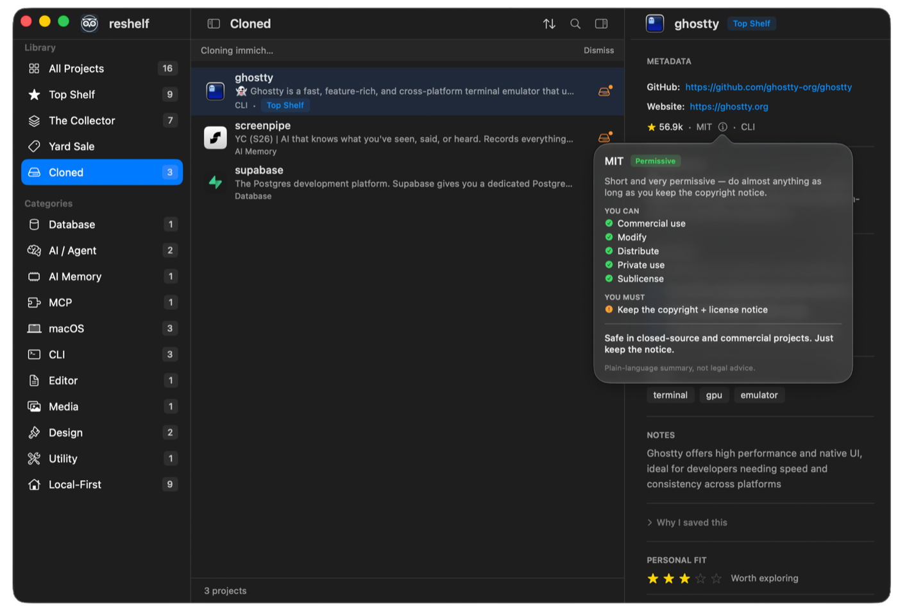
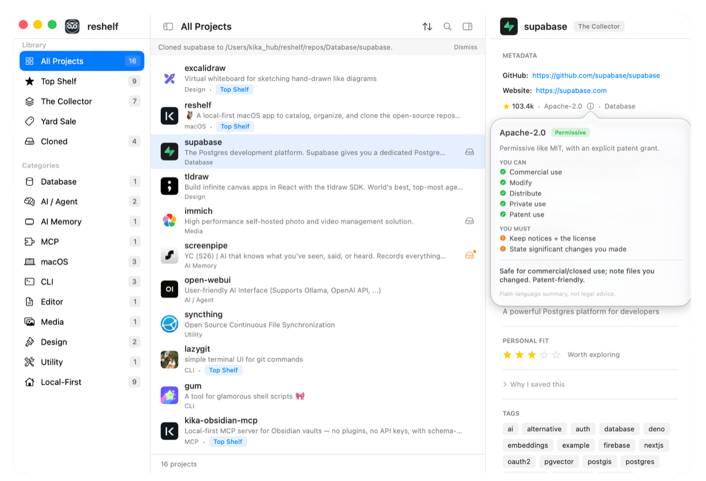

<p align="center">
  
</p>

<h1 align="center">reshelf</h1>

<p align="center">
  <strong>A local-first macOS app for the open-source repos you actually use.</strong><br>
  Capture from GitHub, sort onto shelves, clone by category, and get told when a clone
  has updates to pull.<br>
  <em>No account. No cloud. Your catalog and clones live on your Mac.</em>
</p>

<p align="center">
  <a href="https://github.com/aka-kika/reshelf/releases/latest"></a>
  
  
  
  
  
  
</p>

<p align="center">
  <a href="https://aka-kika.github.io/reshelf/"><strong>aka-kika.github.io/reshelf</strong></a>
</p>

<p align="center">
  
</p>

> **Download:** grab the latest **signed & notarized**
> [`reshelf.dmg` from Releases](https://github.com/aka-kika/reshelf/releases/latest)
> — universal (Apple Silicon + Intel), macOS 14+. Drag to Applications and run; no
> Gatekeeper warnings. Or build from source (below).
>
> The menu bar and Dock show the name **reshelf**; the Xcode project/module keeps the
> legacy name `OpenSourceShelf`.

## What it does

- **Capture fast** — paste a GitHub URL (⌘K or ⌘⇧N); reshelf fetches the metadata
  and **auto-categorizes** it (Database, AI / Agent, macOS, …) — no AI required.
- **Capture Assist (optional, fully on-device)** — on Macs with Apple Intelligence,
  each capture can auto-fill **use cases, a note, and tags** right after you save,
  and a one-click backfill fills entries that have none. No setup, no API keys,
  nothing leaves your Mac — and it never overwrites anything you typed.
  (Settings → General → Capture Assist.)
- **Organize onto shelves** — **Top Shelf** (keepers), **The Collector** (default),
  **Yard Sale** (not sure / let go). Move with one keystroke (⌘T / ⌘Y).
- **Browse by anything** — sidebar filters by shelf, **live category list**, **folders**,
  or **Cloned**. Sort by Recently Added / Name / Most Stars / Last Updated.
- **Folders for what you got them for** — clone thirty repos for one project and group
  them: right-click → **Add to Folder**. Folders are yours to name, sit in their own
  sidebar section, and are separate from categories (what a repo *is*) and shelves (how
  much you value it). **Deleting a folder only ungroups** — nothing else changes.
- **Batch actions** — **⌘-click** rows (or **⇧-click** a range), then move them all to a
  shelf, add them all to a folder, or remove their clones in one go. The whole point of
  folders: retire a project's worth of repos together instead of one at a time.
- **Clone locally, organized** — full clones grouped by category at
  `~/reshelf/repos/<Category>/<repo>`, so you can point an AI agent at one category.
  Works without `git-lfs`.
- **Update checks** — a read-only `git ls-remote` tells you which clones are behind;
  one-click **Pull**, or **Check Clones for Updates** (⌘⇧U) to sweep them all.
- **Understand licenses** — an ⓘ next to any license explains in plain language what
  you can and must do, with an optional caution for copyleft / source-available ones.
- **No duplicates** — capture detects a repo that's already in your catalog;
  **Remove Duplicate Repos** cleans up any you already have.
- **Hard to lose data** — an isolated store plus automatic JSON backups (last 30),
  auto-restore-on-empty, manual restore, and JSON import/export.
- **Updates itself** — **Check for Updates** (or a quiet automatic check) fetches
  signed releases through Sparkle, so you never hunt for a DMG again. Every update is
  EdDSA-signed and notarized; you can turn automatic checks off in Settings.

**AI, when it happens, happens on your Mac.** Capture Assist fills in use cases, a
note and tags with on-device Apple Intelligence — no key, no setup, nothing sent
anywhere. There is no provider to choose and no cloud option to turn on.

<p align="center">
  
  <br>
  <em>The <strong>Cloned</strong> filter: see which local clones are behind upstream and pull with one click.</em>
</p>

<p align="center">
  
  <br>
  <em>Every license explains itself in plain language — what you can do, what you must do,
  and whether it's safe to reuse in something closed-source.</em>
</p>

<p align="center">
  
  <br>
  <em>Light or dark, following macOS or pinned in Settings.</em>
</p>

## In one minute

1. Build and run (see below) — you get a **sidebar**, **project list**, and **inspector**.
2. Press **⌘K**, paste a GitHub URL → Quick Capture opens with everything fetched →
   **Enter** to fetch, **Enter** again to save (no mouse needed).
3. Sort it onto a shelf (⌘T Top Shelf, ⌘Y Yard Sale), or filter the sidebar by
   category, **folder**, or **Cloned**.
4. Right-click a repo → **Clone Repository**. The inspector shows **up to date** vs
   **updates available** with a one-click **Pull**.

Tip: drag the sidebar/inspector dividers to resize, and in **Settings** show/hide and
**drag-reorder** the inspector sections.

## How you run it

**Download (no Xcode)** — grab `reshelf.dmg` from
[Releases](https://github.com/aka-kika/reshelf/releases/latest), open it, and drag
**reshelf** to Applications. It's signed & notarized, so it just opens.

To build it yourself:

**Xcode**

1. Open `OpenSourceShelf.xcodeproj`.
2. Select scheme **OpenSource Shelf** (the scheme/target keep the legacy name; the
   built app is **`reshelf.app`** via `PRODUCT_NAME`).
3. Run (⌘R).

**Terminal**

```bash
# From the repo root (where OpenSourceShelf.xcodeproj lives):
bash build.sh          # Debug build → .build/reshelf.app
# or:
xcodebuild -project OpenSourceShelf.xcodeproj -scheme "OpenSource Shelf" \
  -destination 'platform=macOS' build
```

**Requirements:** macOS 14+ with **Xcode 16+** (Swift 6, SwiftUI, SwiftData).
Resolves **GRDB** via Swift Package Manager on first build.

## Where data lives

| What | Where |
|------|-------|
| Catalog (projects, folders, settings) | `~/reshelf/catalog.store` (SwiftData — isolated, not the shared default store) |
| Automatic JSON backups | `~/reshelf/backups/` (last 30 add/remove/background snapshots) |
| Local clones | `~/reshelf/repos/<Category>/<repo>` (grouped by category; full clones) |
| Clone + metadata records | `~/reshelf/database/opensource-shelf.sqlite` (GRDB) |

## Extending reshelf with skills 🧩

reshelf keeps your clones in a predictable, scriptable layout —
`~/reshelf/repos/<Category>/<repo>` — and your catalog as plain JSON in
`~/reshelf/backups/`. That makes it easy to point AI agents and tools at the library
you've curated. In effect, your cloned shelf doubles as a **source-as-context**
reference: when a coding agent is unsure of a library's API, it can search the *real*
cloned source instead of guessing from stale docs.

We ship three **Claude Code skills** in [`extras/`](extras) — three lenses on the same
shelf. The main one installs itself: **Settings → General → Agent Skill → Install
reshelf Skill** copies it straight to `~/.claude/skills/reshelf`, no cloning needed.

- [`reshelf-skill/`](extras/reshelf-skill) — the **source**: maps your *cloned* repos by
  category, reads their source/READMEs, recommends the best fit for a goal, and suggests
  next steps — **learn** the approach or **use** the code.
  ([README](extras/reshelf-skill/README.md))
- [`reshelf-catalog-skill/`](extras/reshelf-catalog-skill) — the **index**: surveys your
  *whole* catalog (the live store + JSON backups), including repos you shelved but never
  cloned, and highlights the not-cloned gap — so a top-shelf pick you forgot to clone
  never gets lost. ([README](extras/reshelf-catalog-skill/README.md))
- [`reshelf-collector-skill/`](extras/reshelf-collector-skill) — the **rest**: resurfaces
  The Collector's forgotten middle (Yard Sale excluded) with clone status and shelf age,
  leading with the longest-shelved picks you never cloned — and suggests what to
  promote, clone, or let go. ([README](extras/reshelf-collector-skill/README.md))

**Built something that talks to reshelf?** A skill, script, or integration — feeding a
category's clones to a coding agent, generating a "what to learn next" digest, syncing
your shelf to a notes app, anything. **If it's good, we'd love to try it.** Open an
issue or PR with a link (or drop it under `extras/`). Community integrations are
explicitly welcome.

## Shortcuts

| Shortcut | Action |
|----------|--------|
| ⌘K | Command palette — search or paste a GitHub URL |
| ⌘⇧N | Quick Capture (GitHub URL) |
| ⌘N | New project (manual) |
| ⌘T / ⌘Y / ⌘⇧G | Move selected repo to Top Shelf / Yard Sale / The Collector |
| ⌘⇧U | Check clones for updates |
| ⌘⇧E | Export catalog as JSON |
| ⌘S / ⌘I | Toggle sidebar / inspector |

## Privacy and network

- **GitHub API** — only when you use Quick Capture (repo metadata).
- **AI** — never leaves the Mac. Capture Assist runs on-device Apple Intelligence; there is no cloud provider to configure.
- **Update checks** — Sparkle fetches a static appcast from GitHub Pages. Nothing about you is sent; it's a plain file request.
- No sign-in, no required cloud sync. Credentials (when used) live in the macOS Keychain.

## FAQ

### Is reshelf free?

Yes — free and open source under the MIT license. Download the signed, notarized
`reshelf.dmg` from [Releases](https://github.com/aka-kika/reshelf/releases/latest),
or build it from source.

### How is this different from GitHub stars or browser bookmarks?

Stars are a flat, ever-growing pile on GitHub's servers; bookmarks disappear into the
browser. reshelf is a GitHub repository organizer that lives on your Mac: every repo
you capture is auto-categorized, sorted onto a shelf by how much you value it, and
groupable into folders by project — so "what did I save for X, and which one should I
actually use?" takes seconds, not a scroll through hundreds of stars. And when you're
ready to use a repo, reshelf clones it into an organized local library and tells you
when it's behind upstream.

### Does it run on Apple Silicon and Intel Macs?

Yes. Every release is a universal binary (arm64 + x86_64) for macOS 14 or later,
signed and notarized with a Developer ID — it opens with no Gatekeeper warnings.

### Does reshelf need an account or send my data anywhere?

No account, no cloud, no telemetry. Your catalog and clones stay on your Mac. The
GitHub API is called only when you capture a repo, and the optional Capture Assist
runs entirely on-device with Apple Intelligence — there is no cloud AI provider to
configure at all.

### Can AI coding agents use my shelf?

Yes — clones land in a predictable `~/reshelf/repos/<Category>/<repo>` layout, the
catalog exports as plain JSON, and reshelf ships
[Claude Code skills](#extending-reshelf-with-skills-) that let an agent search the
real source you curated instead of guessing from stale docs.

### Where does my data live, and can I lose it?

Everything sits under `~/reshelf/` in open formats (SwiftData store, SQLite, plain
git clones, JSON backups) — see [Where data lives](#where-data-lives). reshelf keeps
the last 30 automatic JSON backups and restores from them if the catalog ever comes
up empty.

## Stack

- **SwiftUI** — interface · **SwiftData** — the catalog you see
- **GRDB (SQLite)** — a second store for clone and metadata records
- **GitHub REST** — repo metadata on capture · **Apple Intelligence** — on-device fills
- **Sparkle** — signed in-app updates from an EdDSA-signed appcast

## Roadmap

v1 is **the Catalog**. Next up is **GitHub login inside the app** (read-only, token in
Keychain) to power better recommendations — full spec in
[v2.0-roadmap.md](v2.0-roadmap.md). Broader ideas live in
[future-features.md](future-features.md).

## Why I built this

I kept finding great open-source repos — in browser tabs, GitHub stars, links I'd
never open again — and losing them. Stars are a pile; tabs are a mess. I wanted a
calm, local place to keep the ones that matter to *me*: decide quickly whether
something is a keeper, a maybe, or a let-go, and when I'm ready to actually use a
repo, pull its code close to learn from it.

reshelf is that shelf. It lives on my Mac, needs no account, and stays out of the
way. I use it every day — I hope it's useful to you too.

— Kika ([@akakika](https://github.com/aka-kika))

## Contributing

Bug reports, fixes, features, docs, design feedback, and integrations are all welcome.
Start with [CONTRIBUTING.md](CONTRIBUTING.md) for build steps and the one gotcha (new
Swift files must be registered in `project.pbxproj`). Use the issue templates.

## Project docs

| File | Purpose |
|------|---------|
| [features.md](features.md) | What works today |
| [goals.md](goals.md) | Why the app exists and product principles |
| [v2.0-roadmap.md](v2.0-roadmap.md) | What's next (GitHub login) |
| [future-features.md](future-features.md) | Ideas not built yet |
| [todo.md](todo.md) | Working checklist + recent history |
| [CHANGELOG.md](CHANGELOG.md) | Release notes |
| [site/](site) | Source of the landing page at [aka-kika.github.io/reshelf](https://aka-kika.github.io/reshelf/); deployed by copying to the `gh-pages` branch, which also hosts the Sparkle appcast |
| [CONTRIBUTING.md](CONTRIBUTING.md) · [SECURITY.md](SECURITY.md) · [AGENTS.md](AGENTS.md) | Contributing, security, agent/architecture notes |

## License

[MIT](LICENSE) © reshelf contributors.
