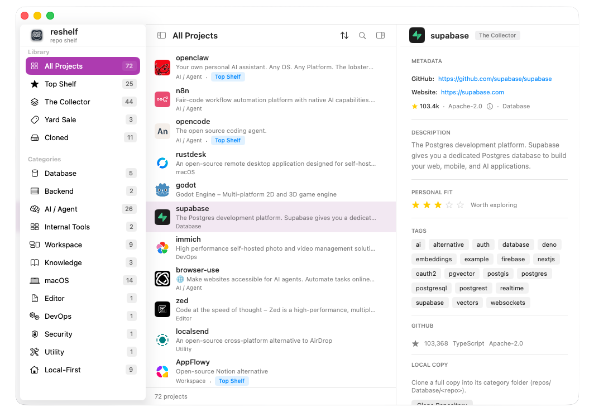
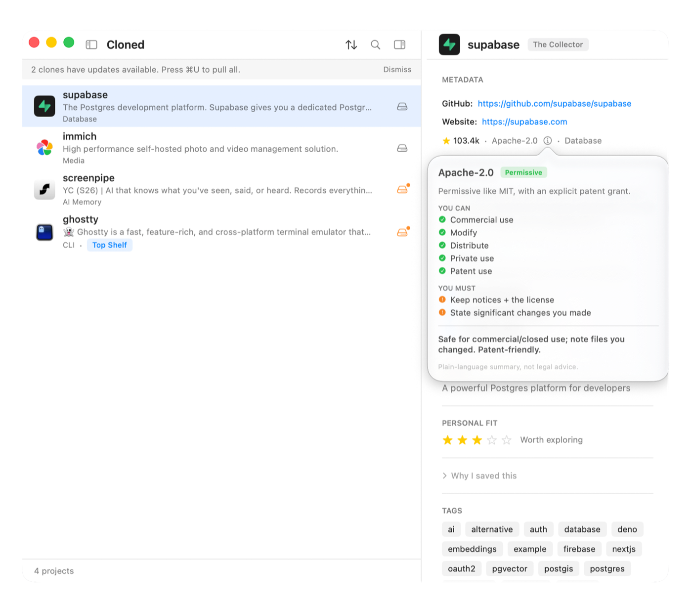

# reshelf 🦉

**reshelf** (repo shelf) is a **local-first macOS app** for keeping a personal shelf
of open-source repos you actually use — capture from GitHub, organize onto shelves,
clone locally by category, and get told when a clone has updates to pull.

No account. No cloud. Your catalog and clones live on your Mac.

<p align="center">
  
</p>

[](https://github.com/aka-kika/reshelf/releases/latest)


> **Download:** grab the latest **signed & notarized**
> [`reshelf.dmg` from Releases](https://github.com/aka-kika/reshelf/releases/latest)
> — universal (Apple Silicon + Intel), macOS 14+. Drag to Applications and run; no
> Gatekeeper warnings. Or build from source (below).
>
> The menu bar and Dock show the name **reshelf**; the Xcode project/module keeps the
> legacy name `OpenSourceShelf`.

## What it does

- **Capture fast** — paste a GitHub URL (⌘K or ⌘⇧N); reshelf fetches the metadata
  and **auto-categorizes** it (Database, AI / Agent, macOS, …) — no AI required.
- **Organize onto shelves** — **Top Shelf** (keepers), **The Collector** (default),
  **Yard Sale** (not sure / let go). Move with one keystroke (⌘T / ⌘Y).
- **Browse by anything** — sidebar filters by shelf, **live category list**, or
  **Cloned**. Sort by Recently Added / Name / Most Stars.
- **Clone locally, organized** — full clones grouped by category at
  `~/reshelf/repos/<Category>/<repo>`, so you can point an AI agent at one category.
  Works without `git-lfs`.
- **Update checks** — a read-only `git ls-remote` tells you which clones are behind;
  one-click **Pull**, or **Check Clones for Updates** (⌘⇧U) to sweep them all.
- **Understand licenses** — an ⓘ next to any license explains in plain language what
  you can and must do, with an optional caution for copyleft / source-available ones.
- **No duplicates** — capture detects a repo that's already in your catalog;
  **Remove Duplicate Repos** cleans up any you already have.
- **Hard to lose data** — an isolated store plus automatic JSON backups (last 30),
  auto-restore-on-empty, manual restore, and JSON import/export.

The **Intelligence engine** (clone + AI analysis, runbooks, Compare, Ecosystems) is a
**v2 preview** behind **Settings → Enable Intelligence** (off by default).

<p align="center">
  
  <br>
  <em>The <strong>Cloned</strong> filter: see which local clones are behind upstream and pull with one click.</em>
</p>

## In one minute

1. Build and run (see below) — you get a **sidebar**, **project list**, and **inspector**.
2. Press **⌘K**, paste a GitHub URL → Quick Capture opens with everything fetched →
   **Enter** to fetch, **Enter** again to save (no mouse needed).
3. Sort it onto a shelf (⌘T Top Shelf, ⌘Y Yard Sale), or filter the sidebar by
   category or **Cloned**.
4. Right-click a repo → **Clone Repository**. The inspector shows **up to date** vs
   **updates available** with a one-click **Pull**.

Tip: drag the sidebar/inspector dividers to resize, and in **Settings** show/hide and
**drag-reorder** the inspector sections.

## How you run it

**Download (no Xcode)** — grab `reshelf.dmg` from
[Releases](https://github.com/aka-kika/reshelf/releases/latest), open it, and drag
**reshelf** to Applications. It's signed & notarized, so it just opens.

To build it yourself:

**Xcode**

1. Open `OpenSourceShelf.xcodeproj`.
2. Select scheme **OpenSource Shelf** (the scheme/target keep the legacy name; the
   built app is **`reshelf.app`** via `PRODUCT_NAME`).
3. Run (⌘R).

**Terminal**

```bash
# From the repo root (where OpenSourceShelf.xcodeproj lives):
bash build.sh          # Debug build → .build/reshelf.app
# or:
xcodebuild -project OpenSourceShelf.xcodeproj -scheme "OpenSource Shelf" \
  -destination 'platform=macOS' build
```

**Requirements:** macOS 14+ with **Xcode 16+** (Swift 6, SwiftUI, SwiftData).
Resolves **GRDB** via Swift Package Manager on first build.

## Where data lives

| What | Where |
|------|-------|
| Catalog (projects, settings) | `~/reshelf/catalog.store` (SwiftData — isolated, not the shared default store) |
| Automatic JSON backups | `~/reshelf/backups/` (last 30 add/remove/background snapshots) |
| Local clones | `~/reshelf/repos/<Category>/<repo>` (grouped by category; full clones) |
| Intelligence layer (v2 preview) | `~/reshelf/database/opensource-shelf.sqlite` (GRDB) |

## Extending reshelf with skills 🧩

reshelf keeps your clones in a predictable, scriptable layout —
`~/reshelf/repos/<Category>/<repo>` — and your catalog as plain JSON in
`~/reshelf/backups/`. That makes it easy to point AI agents and tools at the library
you've curated. In effect, your cloned shelf doubles as a **source-as-context**
reference: when a coding agent is unsure of a library's API, it can search the *real*
cloned source instead of guessing from stale docs.

We ship a **Claude Code skill** in [`extras/reshelf-skill/`](extras/reshelf-skill) that
turns your shelf into a working reference: it maps your cloned repos by category,
reads their source/READMEs, recommends the best fit for a goal, and suggests next
steps — **learn** the approach or **use** the code. See its
[README](extras/reshelf-skill/README.md) to install.

**Built something that talks to reshelf?** A skill, script, or integration — feeding a
category's clones to a coding agent, generating a "what to learn next" digest, syncing
your shelf to a notes app, anything. **If it's good, we'd love to try it.** Open an
issue or PR with a link (or drop it under `extras/`). Community integrations are
explicitly welcome.

## Shortcuts

| Shortcut | Action |
|----------|--------|
| ⌘K | Command palette — search or paste a GitHub URL |
| ⌘⇧N | Quick Capture (GitHub URL) |
| ⌘N | New project (manual) |
| ⌘T / ⌘Y / ⌘⇧G | Move selected repo to Top Shelf / Yard Sale / The Collector |
| ⌘⇧U | Check clones for updates |
| ⌘⇧E | Export catalog as JSON |
| ⌘S / ⌘I | Toggle sidebar / inspector |

## Privacy and network

- **GitHub API** — only when you use Quick Capture (repo metadata, optional README).
- **Ollama / cloud AI** — only if you enable the v2 Intelligence preview and configure a provider.
- No sign-in, no required cloud sync. Credentials (when used) live in the macOS Keychain.

## Stack

- **SwiftUI** — interface · **SwiftData** — the catalog you see
- **GRDB (SQLite)** — the v2 intelligence store (dormant until Labs is on)
- **GitHub REST** + optional **Ollama / cloud AI** — helpers

## Roadmap

v1 is **the Catalog**. Next up is **GitHub login inside the app** (read-only, token in
Keychain) to power better recommendations — full spec in
[v2.0-roadmap.md](v2.0-roadmap.md). Broader ideas live in
[future-features.md](future-features.md).

## Why I built this

I kept finding great open-source repos — in browser tabs, GitHub stars, links I'd
never open again — and losing them. Stars are a pile; tabs are a mess. I wanted a
calm, local place to keep the ones that matter to *me*: decide quickly whether
something is a keeper, a maybe, or a let-go, and when I'm ready to actually use a
repo, pull its code close to learn from it.

reshelf is that shelf. It lives on my Mac, needs no account, and stays out of the
way. I use it every day — I hope it's useful to you too.

— Kika ([@akakika](https://github.com/aka-kika))

## Contributing

Bug reports, fixes, features, docs, design feedback, and integrations are all welcome.
Start with [CONTRIBUTING.md](CONTRIBUTING.md) for build steps and the one gotcha (new
Swift files must be registered in `project.pbxproj`). Use the issue templates.

## Project docs

| File | Purpose |
|------|---------|
| [features.md](features.md) | What works today |
| [goals.md](goals.md) | Why the app exists and product principles |
| [v2.0-roadmap.md](v2.0-roadmap.md) | What's next (GitHub login) |
| [future-features.md](future-features.md) | Ideas not built yet |
| [todo.md](todo.md) | Working checklist + recent history |
| [CHANGELOG.md](CHANGELOG.md) | Release notes |
| [CONTRIBUTING.md](CONTRIBUTING.md) · [SECURITY.md](SECURITY.md) · [AGENTS.md](AGENTS.md) | Contributing, security, agent/architecture notes |

## License

[MIT](LICENSE) © reshelf contributors.
