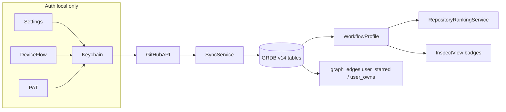

# reshelf v2.0 roadmap — GitHub workflow connection

> ⭐️ **FIRST UP AFTER v1 TESTING:** **GitHub login inside the app.** This is the
> #1 v2 item to build right after the v1 test round — an in-app "Connect GitHub"
> flow (OAuth device flow primary, fine-grained PAT fallback; token in Keychain).
> Everything below is the full spec for it.

> **Status:** Planned for v2.0. **Not in the current app.** reshelf today stays local-only with unauthenticated GitHub reads for Quick Capture only. Do not implement this until v2.0 is explicitly scoped.

## In one minute

v2.0 adds an **optional** “Connect GitHub” flow so reshelf can learn which repos you star and own on GitHub, build a **local workflow profile**, and use that to improve **recommendations** and **personal fit** explanations. There is still **no reshelf account** — the token lives in **Keychain** on your Mac, and you can disconnect anytime.

## Why v2.0 (problem today)

| Today | With GitHub connection (v2.0) |
|-------|-------------------------------|
| Quick Capture hits the public GitHub API with no user context (low rate limit) | Authenticated reads when connected; better limits |
| Recommendations use graph + static analysis **inside your shelf only** | Same engine, plus boosts when a tool matches **your** GitHub topics/languages |
| Workflow flags (`Codex`, `Local AI`, etc.) are manual | Optional hints from what you actually star and maintain |
| “My Stack” is synthesized from catalog intelligence only | Can reflect repos that are central **on GitHub** but not yet captured |

## Product boundaries (unchanged)

- **Read-only** — fetch metadata (stars, topics, languages). No git clone, install, or repo mutation from the app.
- **Optional** — app works fully without GitHub; connection is enrichment, not a gate.
- **Local-first** — token in Keychain; synced data in GRDB at `~/reshelf/database/opensource-shelf.sqlite`. Nothing sent to a reshelf cloud.
- **No reshelf login** — GitHub OAuth/PAT is third-party auth for GitHub only.

## What we sync (v2.0 scope)

**In scope**

- Your **starred** repositories
- Repositories **you own**
- Derived **workflow profile**: top topics, languages, inferred categories (via existing `CategoryClassifier`)

**Out of scope for v2.0**

- Org-wide activity, following graph, contribution calendar
- Auto-importing every starred repo without confirmation
- Syncing profile across Macs
- Replacing manual workflow flags entirely (suggest only, later)

## Auth options

Ship **both** paths; user picks in Settings.

| Method | UX | Notes |
|--------|-----|-------|
| **OAuth Device Flow** (primary) | “Connect GitHub” → browser → enter code | Best for desktop; register a GitHub OAuth app for reshelf |
| **Fine-grained PAT** (fallback) | Paste token in Settings | Power-user path; validate with `GET /user` |

**Storage:** Keychain only (`Security` framework). Never SwiftData, UserDefaults, or GRDB.

**Scopes:** `read:user` plus read access to repo metadata (classic read-only `repo` or fine-grained “Metadata”). Needed to list your stars and owned repos.

**Disconnect:** delete Keychain item + clear synced GRDB rows.

## Architecture

## Data model — GRDB migration `v14_user_github`

New tables in `IntelligenceMigrations.swift`:

- **`user_github_account`** — login, display name, avatar URL, `last_synced_at`, token source (`device` / `pat`)
- **`user_github_repos`** — `full_name`, `github_url`, `source` (`starred` | `owned`), `starred_at`, `topics_json`, `primary_language`, `pushed_at`, `synced_at`
- **`user_workflow_profile`** — cached aggregate: top topics, top languages, inferred categories, `generated_at`

Indexes on `github_url` and `full_name` for joins to existing `repositories` rows.

## New services

### `GitHubTokenStore` + `GitHubAPIClient`

- Centralize HTTP today split in `QuickCaptureService`
- Attach `Authorization: Bearer …` when connected
- Pagination for `/user/starred` and `/user/repos?affiliation=owner`
- Rate-limit handling with user-visible status in Settings

### `GitHubAuthService`

- Device Flow: `POST /login/device/code` → browser → poll `POST /login/oauth/access_token`
- PAT: validate and store

### `GitHubUserSyncService`

- Ingestion job type: `github_user_sync` (same patterns as `RepositoryIngestionService`)
- Triggers: connect, manual Refresh, optional daily refresh toggle
- Upsert repos; rebuild workflow profile
- **Graph bridge:** for repos already on the shelf, add `graph_edges` with `user_starred` / `user_owns` (`created_by: github_sync`)
- **Catalog gaps:** starred/owned URLs not in SwiftData `ToolProject` → “Suggested from GitHub” list (user confirms before Quick Capture)

### `UserWorkflowProfileService`

- Aggregate topics and languages from synced repos
- Map to sidebar categories (Database, Agent, macOS, etc.)
- Expose `interestMatchScore` for scoring and UI badges

## Recommendations and discovery

Extend `RecommendationScoringContext` in `RelationshipScoringService.swift`:

- Topic overlap with user’s GitHub topics (cap ~15 pts)
- Language overlap (cap ~8 pts)
- Boost if target is user-starred (+10) or user-owned (+6)
- Explainability strings, e.g. `matches your GitHub topics: ollama, swiftui`

Wire into `RepositoryRankingService.rank`. Invalidate recommendation cache when `user_workflow_profile.generated_at` changes.

Pass profile into `WorkflowClusterService` so **My Stack** can note GitHub-central repos.

## UI (v2.0)

### Settings — GitHub section

- Disconnected: Connect GitHub + optional PAT field
- Connected: @username, last sync, Refresh now, Disconnect
- Short privacy note: read-only, local, revoke on GitHub anytime

### Inspect and catalog

- Chips: **In your GitHub stars** / **You own this on GitHub**
- Recommendation rows show GitHub-derived signals when present
- Optional banner: “N starred repos not on your shelf” → sheet to Quick Capture (confirm each)

**No new sidebar category** in v2.0 — keep the catalog-first sidebar calm.

## Implementation checklist

- [ ] Keychain + `GitHubAPIClient` + authenticated requests
- [ ] Device Flow + PAT fallback; Settings GitHub section
- [ ] GRDB migration v14 + `IntelligenceDatabase` accessors
- [ ] `GitHubUserSyncService` (stars + owned, graph edges, catalog gaps)
- [ ] `UserWorkflowProfileService` + recommendation scoring boosts
- [ ] Inspect badges + optional suggested-from-GitHub sheet
- [ ] Update `goals.md`, `features.md`, `future-features.md`, `AGENTS.md`
- [ ] Tests: URL matching, topic overlap scoring, migration v14 round-trip

## Verification (when built)

1. Connect GitHub → sync completes → Settings shows username and last sync
2. Star a repo that is already on your shelf → Refresh → Inspect shows star chip
3. Open recommendations on a related repo → score/explanation mentions GitHub topic overlap
4. Disconnect → token gone, synced rows cleared, app behaves as today
5. Quick Capture still works **without** connection (unauthenticated public API)

## Related files (current codebase)

| Area | File |
|------|------|
| Public GitHub fetch today | `OpenSourceShelf/Services/QuickCaptureService.swift` |
| Recommendations | `OpenSourceShelf/Services/Recommendations/RecommendationEngine.swift` |
| Scoring | `OpenSourceShelf/Services/Recommendations/RelationshipScoringService.swift` |
| Categories | `OpenSourceShelf/Services/CategoryClassifier.swift` |
| Catalog bridge | `OpenSourceShelf/Services/Compare/IntelligenceRepositoryBridge.swift` |
| Settings pattern | `OpenSourceShelf/Views/SettingsView.swift` |
| Migrations | `OpenSourceShelf/Persistence/IntelligenceMigrations.swift` (next: `v14_user_github`) |

## Doc map

- [README.md](README.md) — run the current app
- [features.md](features.md) — shipped behavior (v1.x)
- [future-features.md](future-features.md) — nearer-term backlog
- [goals.md](goals.md) — product principles
- **This file** — v2.0 GitHub workflow spec (deferred)
